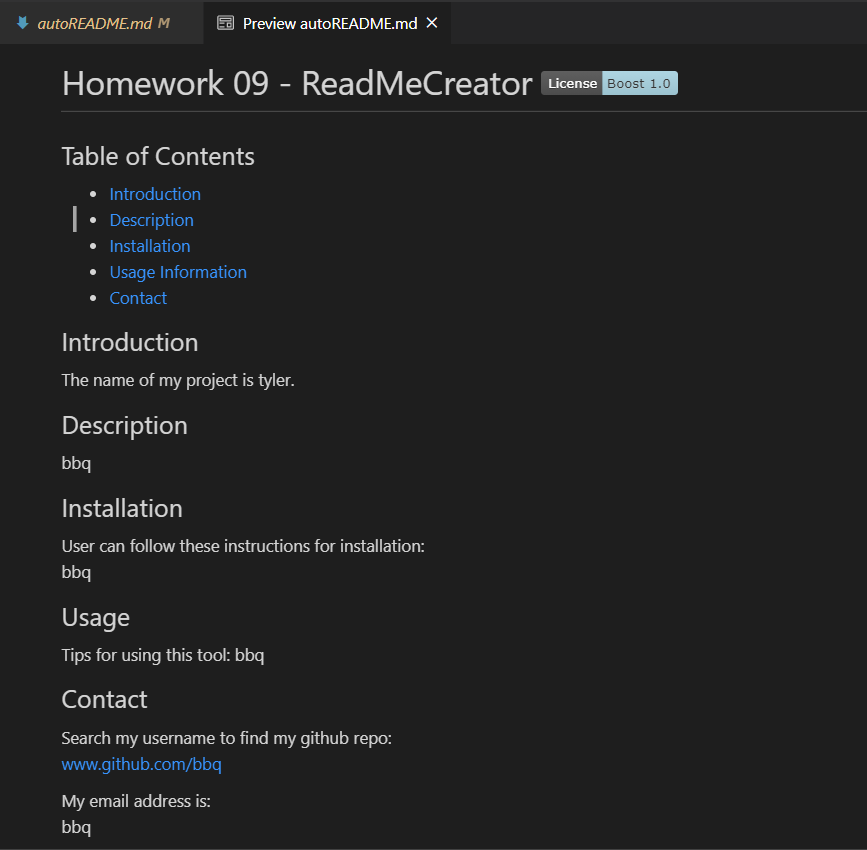

# ReadMdeCreator

Contents of repo:
* index.js
* utils/generateMarkdown.js
* autoREADME.md
* README.md

Additional contents:
* package-lock.json
* package.json

This tool will allow the user to generate a readme through the terminal saved as autoREADME.md. The contents of the readme are dependent on responses in the command line. This requires 'fs' and 'inquirer' npm packages.

The repo can be found here: 
[TPR_GitHub](https://github.com/rutherford87/CanUCode)

The website can be viewed here: [ReadMeCreator](https://rutherford87.github.io/ReadMeCreator/)

Here is a screenshot of the most recent automatically generated file:  

This was challenging but enjoyable. 

Good luck, have fun!